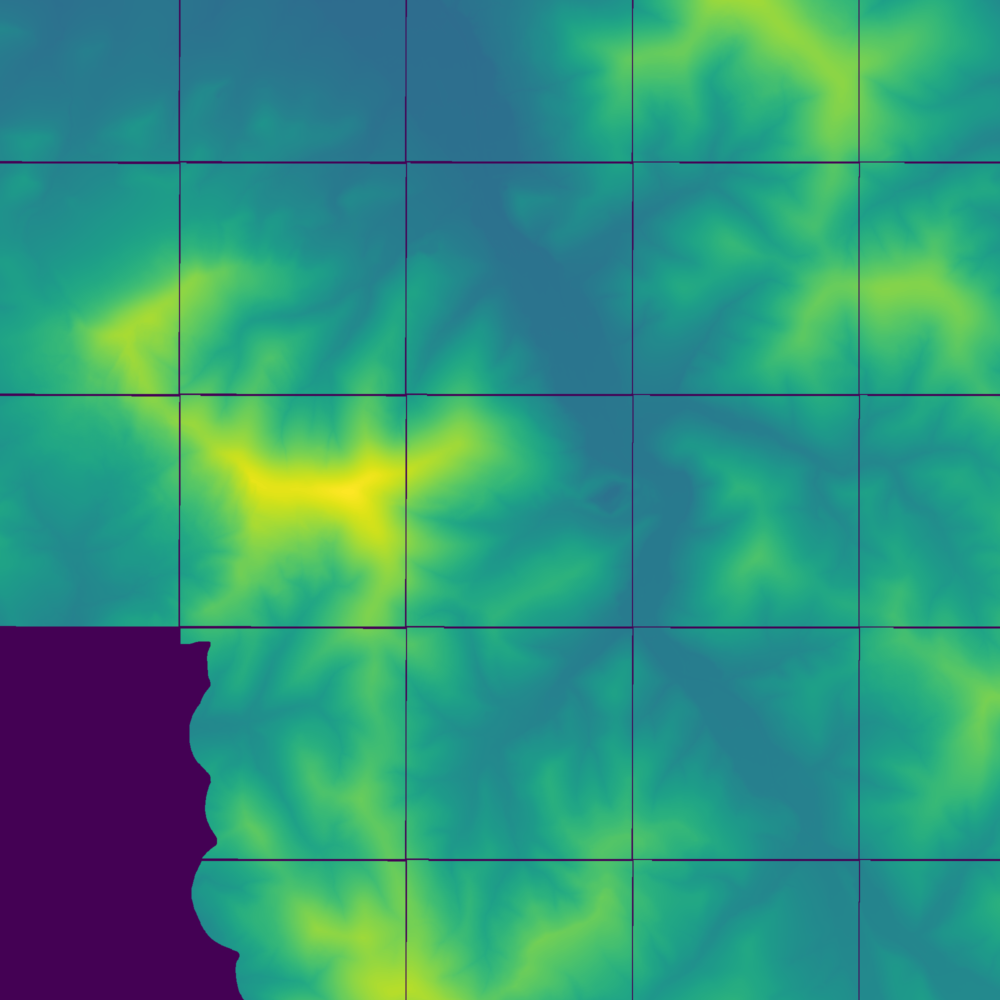
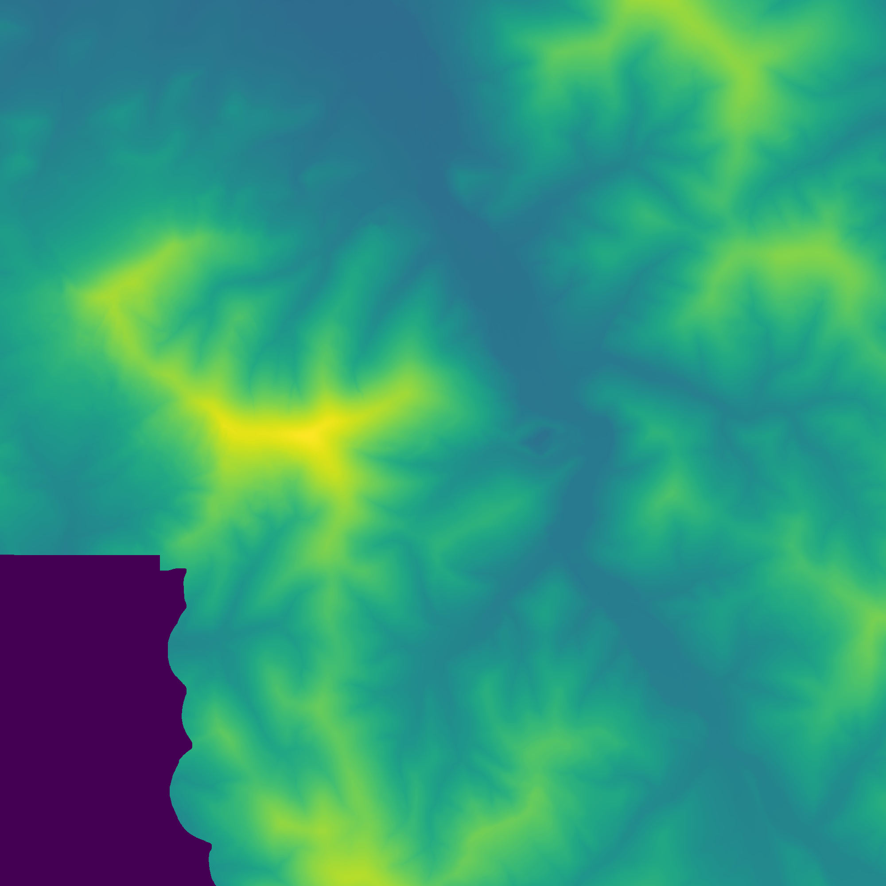

Detecting ridges and valleys in a hypsometric map. For this purpose, it uses files that you can download from the website: https://mapy.geoportal.gov.pl/

At the begin alghorytm concat sheets of map to on big map.

Next interpolate points without data.

At the end detect valleys, ridges and filter results with image processing operations. 

